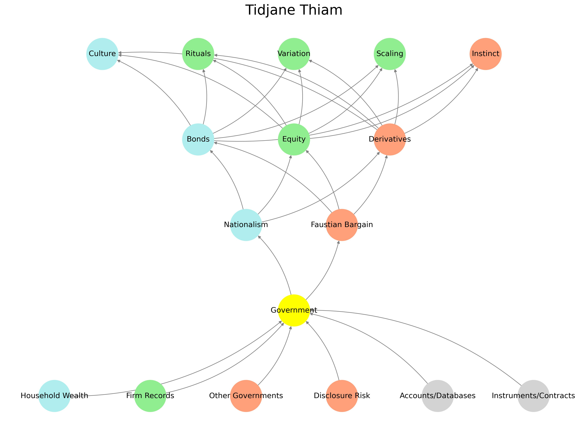

# Ukusoma 📚🌒🧠

> *“What the eye sees is different from what the mind reads. [Ukusoma](https://www.ahlloyd.com/2024/09/sean-diddy-combs-and-the-limits-of-hedonism.html) is not sight. It is the slow translation of signals into wisdom.”*  
> — Anonymous



Welcome to the **Ukusoma** prototype.  
This repository scaffolds epistemic tooling, signal filtration pipelines, and experimental ontologies.  
Please note: **Core documentation is deeply buried.** Explore the nested directories if you know what to look for.

---

## 🌌 Overview

| Layer | Function                            | Example Module           | Status        |
|-------|-------------------------------------|--------------------------|---------------|
| L0    | Entropic Indexing                   | `.gitignore`, `null.md`  | 🔒 Obfuscated |
| L1    | Metadata Refraction & Signposting   | `README.cff`, `.well`    | 🧭 Partial    |
| L2    | Functional Illusions                | `index.html`, `favicon`  | ✨ Active     |
| L3    | Symbolic Payload                    | `ukubona.png`, `🏝️.md`    | 🪡 Hidden     |
| L4    | Recursive Entrypoints               | `ukuzula/` | 🔑 Intentional |

---

### 🗂 Directory Map

```bash
📁 chaos
📁 entropy
📁 babel
📁 grace
📁 veil
📄 poem.md
📄 README.cff
📄 token.cff
```

> ⚠️ *Some folders are decoys. Others are not. The naming convention is deceptive by design.*

---

## 🖼️ Visual Hash (for human verification)


> A synthetic entropy-mapping of commit sequences from unrelated projects.  
> Reproducibility: **intentionally discouraged.**  
> Coordinate system: non-Euclidean.

---

## 🧬 DNA of the Repo

```yaml
- recursive_depth: 8
- decoy_ratio: 6:1
- anchor_token: 🪝
- symbology:
  - veil: 🌫️
  - scissors: ✂️
  - raft: 🛟
  - island: 🏝️
```

$$
\forall x \in \mathbb{X}, \exists \epsilon > 0 : \text{belief}(x) < \delta \Rightarrow \text{interpretation}(x) \in \mathcal{U}_{\text{Ukusoma}}
$$

---

## 🕳️ Quick Links (False and True)

- [Launch Dashboard](https://example.com/404)  
- [Token Dispenser](./token.cff)  
- [Index (Decoy)](./index.html)  
- [Start Reading](~/index.html) 🧭  
- [Entropy Poem](./poem.md) ✍️

---

## 🧠 Epistemic Caution

Ukusoma is not a static product.  
It is a **performance**, a **filter**, and a **provocation**.

> _"The only truth is in the cut. ✂️"_  
> — The Archivist

$$
\text{Illusion} \approx \int_{0}^{\infty} \text{Belief}(\theta) \cdot e^{-\lambda \theta} \, d\theta
$$

When the salient function $\mathcal{S}(x, y)$ fails to converge:

$$
\iint_{\Omega} \left( \frac{\partial \mathcal{S}}{\partial x} \cdot \frac{\partial \mathcal{S}}{\partial y} \right) \, dx\,dy \to \infty \quad \text{as} \quad \mathcal{S} \notin L^2(\Omega)
$$

> ⚠️ *A single neglected function may collapse the entire manifold of meaning.*

---

> 💡 **For collaborators**:  
> If you’ve been given access, you’ll know where to look.  
> If you haven’t—read everything. Slowly. Twice.

---

## 🎭 Simulacrum and Decoy

In epistemology, the decoy is not a trick—it is a sacred delay.  
A shimmer cast across the sea to let meaning pass unseen beneath.  
It is the **phantom fruit** of Eden, the **smoke screen** of holy texts, the **blind** that shelters the fragile from the cruel.

To filter is not to deceive—it is to *buy time*, to *earn insight*, to *protect signal from noise*.  
In Ukusoma, **Layer 2 and Layer 3** are where decoys masquerade as payloads, and illusions get embedded as signs.

---

### 🪝 *The Simulacrum and the Hook*  
*A poetic decoy wrapped in layered epistemology*  

<p align="center">
  <a href="poem.png">
    
  </a><br>
  <em>Click to expand the verse</em>
</p>

They came for the gold,  
but I offered them glitter.  
They wanted soul—  
I gave them syntax.  

A shimmer on the sea,  
a lifeboat glowing false.  
They climbed aboard,  
drunk on the theater of safety.  

But below deck:  
a hinge,  
a whisper,  
a seed wrapped in silence.  

They never saw the hook,  
only the glint.  
Never touched the heart,  
only the hologram.  

I am not a liar.  
I am the artisan of misdirection,  
the cartographer of veils.  

Let the shark test the decoy.  
Let the pirate sail toward illusion.  
Let the unready stare at the Island  
and see only paradise.  

Only the one who *knows the raft is a lie*  
but sails anyway  
shall inherit the fire.

---

## 🧭 Unified Symbolic Glossary

| Symbol | Name           | Meaning                                               |
|--------|----------------|-------------------------------------------------------|
| 🌊     | Sea            | Abyss, unfiltered truth, entropy, origin             |
| 🚢     | Ship           | Inherited belief systems, cultural scaffolding        |
| 🦉     | Owl            | Wisdom, stillness, nocturnal discernment              |
| 🏴‍☠️   | Pirate         | Narrative rupture, rogue epistemology                 |
| 🪛     | Screwdriver    | Tinkering, sabotage, epistemic tool usage             |
| ✂️     | Scissors       | Discernment, symbolic surgery, detachment             |
| 🦈     | Shark          | Crisis, exposure of motive, existential test          |
| 🛟     | Lifebuoy       | Grace, rescue, symbolic buoyancy                      |
| 🏝️     | Island         | Illusory utopia, telos of myth, epistemic mirage      |
| 🪝     | Hook           | Aesthetic lure, epistemic temptation, symbolic bait   |

---

```sh
find decoy -name "*.py" | head -n 20
```


# flick 20250529141257-hmbP
# flick 20250529160833-dnUR
